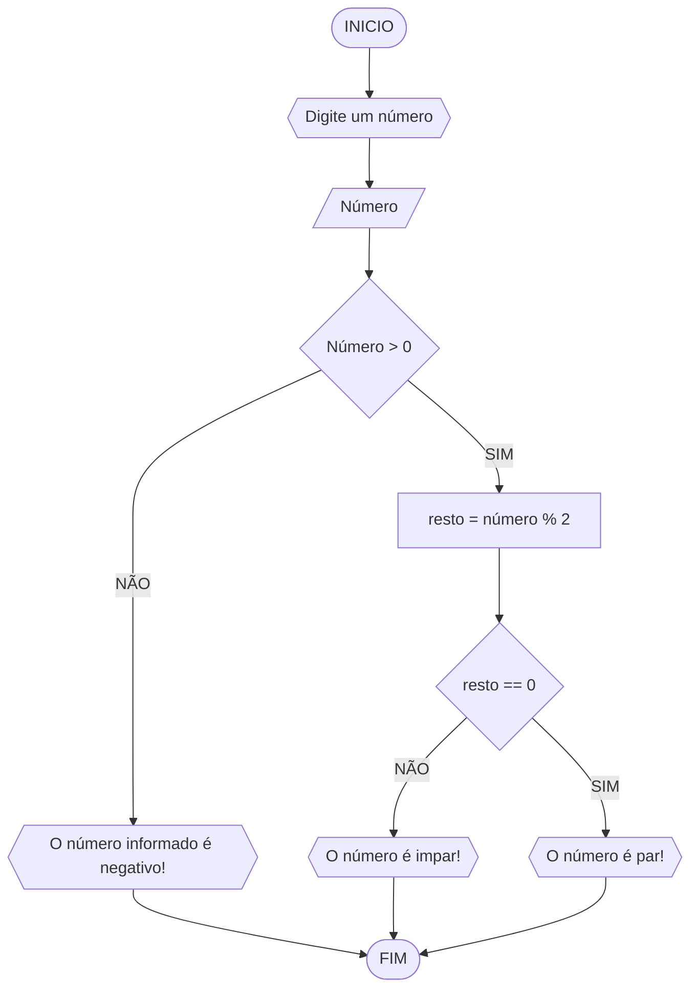

 # UNIFOR
**Disciplina:** Raciocínio lógico algorítmico 
**Orientador:** Professor Ricardo Carubbi

## Lista de exercícios

### Exercício 03
Represente, em fluxograma e pseudocódigo, um algoritmo para determinar se um número inteiro e positivo é par ou ímpar.
#### Fluxograma

#### Pseudocódigo
```
1 ALGORITMO verifica_par_impar
2 DECLARE número resto NUMERICO
3 ESCREVA "Digite um número"
4 LEIA numero
5 SE numero > 0 ENTAO
6   resto = numero % 2 
7   SE resto == 0 ENTAO
8     ESCREVA "O numero é par!"
9   SENAO
10      ESCREVA "O número é impar!"
11 SENAO
12     ESCREVA "O número deve ser positivo!"
FIM_ALGORITMO
```
